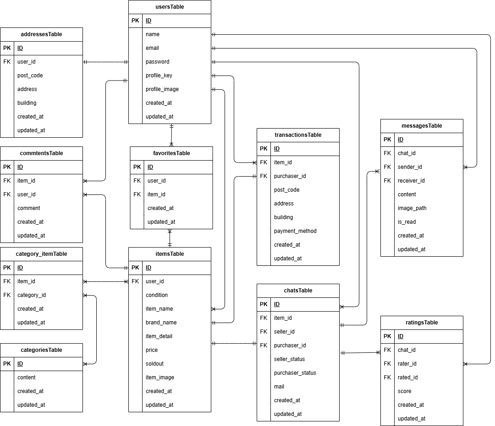

# Fleamarker_app（フリマアプリ）

##　環境構築
**Dockerビルド**
1. `git clone git@hub.com:onodera-j/fleamarket_app.git`
2. DockerDesktopアプリを立ち上げる
3. `docker-compose up -d --build`

> *MacのM1・M2チップのPCの場合、`no matching manifest for linux/arm64/v8 in the manifest list entries`のメッセージが表示されビルドができないことがあります。
エラーが発生する場合は、docker-compose.ymlファイルの「mysql」内に「platform」の項目を追加で記載してください*
``` bash
mysql:
    platform: linux/x86_64(この文追加)
    image: mysql:8.0.26
    environment:
      MYSQL_ROOT_PASSWORD: root
      MYSQL_DATABASE: laravel_db
      MYSQL_USER: laravel_user
      MYSQL_PASSWORD: laravel_pass
```

**Laravel環境構築**
1. `docker-compose exec php bash`
2. `composer install`
3. 「.env.example」ファイルを 「.env」ファイルに命名を変更。または、新しく.envファイルを作成
4. .envに以下の環境変数を修正または追加
``` text
DB_CONNECTION=mysql
DB_HOST=mysql
DB_PORT=3306
DB_DATABASE=laravel_db
DB_USERNAME=laravel_user
DB_PASSWORD=laravel_pass

MAIL_MAILER=smtp
MAIL_HOST=mail
MAIL_PORT=1025
MAIL_USERNAME=TESTmail
MAIL_PASSWORD=null
MAIL_ENCRYPTION=null
MAIL_FROM_ADDRESS=info@example.com
MAIL_FROM_NAME="${APP_NAME}"

```


5. アプリケーションキーの作成
``` bash
php artisan key:generate
```

6. マイグレーションの実行
``` bash
php artisan migrate
```

7. シーディングの実行
``` bash
php artisan db:seed
```

以下のデータを作成します
``` text
アカウント
名前：出品ユーザー1
ID:test1@example.com
PASS:12345678
CO01-CO05までの商品を出品

名前：出品ユーザー2
ID:test1@example.com
PASS:12345678
CO06-CO10までの商品を出品

名前：ダミーユーザー
ID:test3@example.com
PASS:12345678
何も紐づけられていないユーザーデータ

商品データ10件
```

## Stripe決済の導入
クレジット決済時にはダミーデータで決済処理が可能
``` text
4242 4242 4242 4242	Visa	決済成功（標準）
4000 0000 0000 9995	Visa	決済失敗（カード拒否）
有効期限: 未来の日付（例: 12/34）
CVC: 任意の3桁（例: 123）
```
コンビニ決済時は、Stripe決済完了できないため実装を外しています。
コンビニ決済のStripe実装確認は
ItemController line275-302あたりのコメントチェックアウト等で対応可。

## 使用技術(実行環境)
- PHP8.3.0
- Laravel8.83.8
- MySQL8.0.26

## ER図


## URL
- 開発環境：http://localhost/
- phpMyAdmin：http://localhost:8080/
- Mailhog：http://localhost:8025/
